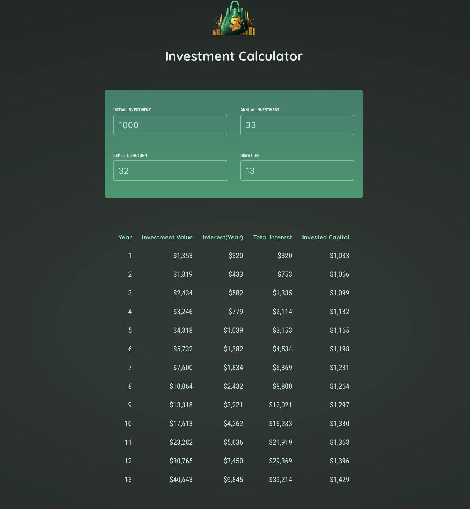

# Investment Calculator

A modern web application built with React and Vite that helps users calculate and visualize their investment returns over time.



## Features

- Calculate investment returns based on initial investment, time period, and interest rate
- Visual representation of investment growth
- User-friendly interface
- Real-time calculations
- Responsive design

## Technologies Used

- React 19
- Vite
- Modern JavaScript (ES6+)
- CSS3

## Getting Started

### Prerequisites

- Node.js (Latest LTS version recommended)
- npm or yarn package manager

### Installation

1. Clone the repository:
```bash
git clone [your-repository-url]
cd InvestmentCalculator
```

2. Install dependencies:
```bash
npm install
```

3. Start the development server:
```bash
npm run dev
```

The application will be available at `http://localhost:5173` by default.

### Building for Production

To create a production build:

```bash
npm run build
```

To preview the production build:

```bash
npm run preview
```

## Available Scripts

- `npm run dev` - Start development server
- `npm run build` - Build for production
- `npm run preview` - Preview production build
- `npm run lint` - Run ESLint for code quality

## Project Structure

```
InvestmentCalculator/
├── src/              # Source files
├── public/           # Static assets
├── index.html        # Entry HTML file
├── vite.config.js    # Vite configuration
└── package.json      # Project dependencies and scripts
```

## Contributing

1. Fork the repository
2. Create your feature branch (`git checkout -b feature/AmazingFeature`)
3. Commit your changes (`git commit -m 'Add some AmazingFeature'`)
4. Push to the branch (`git push origin feature/AmazingFeature`)
5. Open a Pull Request

## License

This project is licensed under the MIT License - see the LICENSE file for details.

## Acknowledgments

- Built with [React](https://reactjs.org/)
- Bundled with [Vite](https://vitejs.dev/) 
